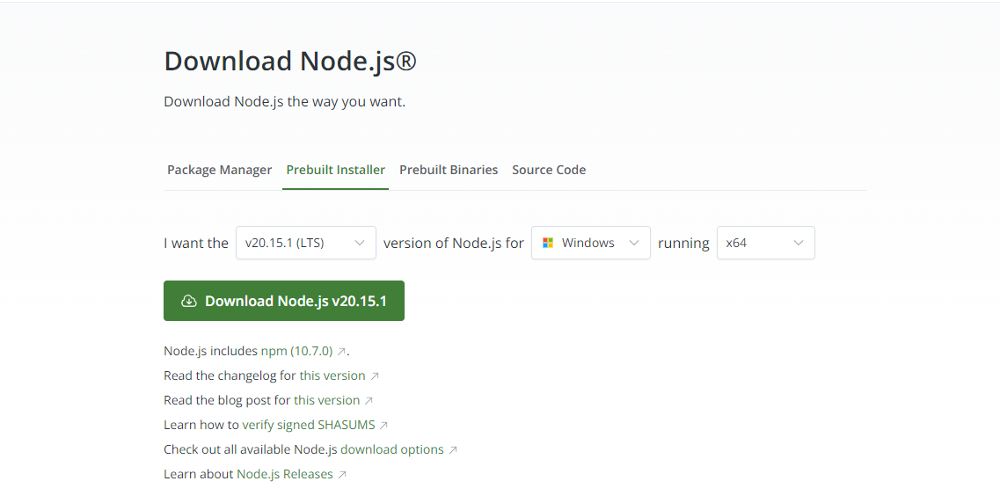
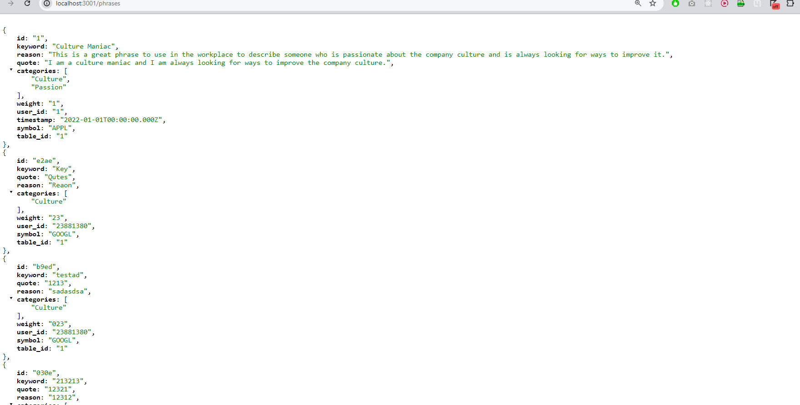

This repository is to create a website where students can learn how financial statements of corporations explain their investments in human capital while participating in games to demonstrate their accounting and finance knowledge and ability to understand and analyze fundamental information on stocks.

CRHCAP Project 2024

Title: Crowd Learning of New Perspectives on Investments Using Textual Analysis and Machine Learning of Financial Statements 

Tasks: Developing front-end and backend codes to analyze Investments in human capital to improve stock valuation tools using text data from the SEC

STEP 1 – Developing a Learning Game to Assign a Role to Participating Students in a Team STEP 2 – Developing codes to assign stocks to each team and to receive keywords and rankings STEP 3 – Developing NLP and ML models to evaluate human rankings and keywords

STEP 1 – Start with four questions. Question 1: What is your Empl ID? Collect IDs, answers, and scores and generate an output csv file. If the ID matches with one in the class list, give 1 point. If not, show an error message “The ID you entered is not in the class list.”

Question 2: Human capital is one of the most important assets corporations use to provide goods and services to their customers in the digital economy that started in the mid-1990s with the rapid growth of the internet. Does the balance sheet of a corporation record human capital as assets? Choices: 
- Yes
- No
(Correct answer – give 1 point)


Question 3: Code this question to give all students different numbers. CRH has sales of $674,000, costs of $336,000, depreciation expense of $80,000, interest expense of $50,000, and a tax rate of 22 percent. The net income for this firm is $__________.

Input: Sales = random number between 520,000 and 943,000. Costs = 0.4985sales Depreciation expense = 0.1187sales Interest expense = 0.0742*sales Tax rate = randomly choose one among (22%, 24%, and 32%)

Multiple Choices: 

- A. Sales0.2407 (Correct answer – give 1 point)
- B. Sales0.2978
- C. Sales0.4452
- D. Sales0.4723

Answer: Net income = (sales – costs – depreciation – interest expense)(1-tax rate) = sales(1-0.4985-0.1187-0.0742)(1-0.22) = sales0.30860.78=6740000.2407 = $162,237

Ask to :

- provide formula


Question 4: Financial statement texts of large corporations explain how they manage human capital and this project requires reading the 10K of a company. You have two options when you submit your findings after the reading. One is to write a summary report and the other is to submit ten to fifteen keywords that will be used as an input to develop a machine learning model for analyzing human capital. Which option is your choice?
Are you willing to participate in a project that requires reading the financial statement of a company and submitting the keywords you identified for human capital management? Choices: I will write a report (Show “See Blackboard for the instructions on the report.”) I will submit keywords to be used as an input to a machine learning model (Assigning a role: If a student earned 3 out of 3, show “Congratulations! You earned a “Team Leader” status.” else, show “You earned a team member status in the project.”) 

STEP 2: Develop codes to assign stocks and collect keywords. Test the codes using the sample keyword list Hyuna Park developed. 

STEP3: Refine the NLP and ML codes using the templates and W2V models Hyuna Park developed.


# Development Notes

## requirements:

https://nodejs.org/en/download/prebuilt-installer




## To install and run locally:


1. Clone repository

```bash
git clone https://github.com/hpark507/CRHCAP.git
```

2. Run Server Locally

Note the server here, is a mock server with the intention of simulating a real server.

```bash
cd server 
cd mockup -- this is the mock server
npm install -g json-server
npx json-server db.json -p 3001 --watch
```


test

```
http://localhost:3001/phrases
```



3. Run Client Locally

```bash
cd client
npm install
npm run dev
```


## Relevant Links for Development

- [Design Doc](https://snip.mathpix.com/wangnelson2/notes/crowd-learning-of-human-capital---design-document-192e64e2-0745-46d8-a6b9-9a8d6a880c5d)


## Notes

- Stacks: Nextjs Typescript


